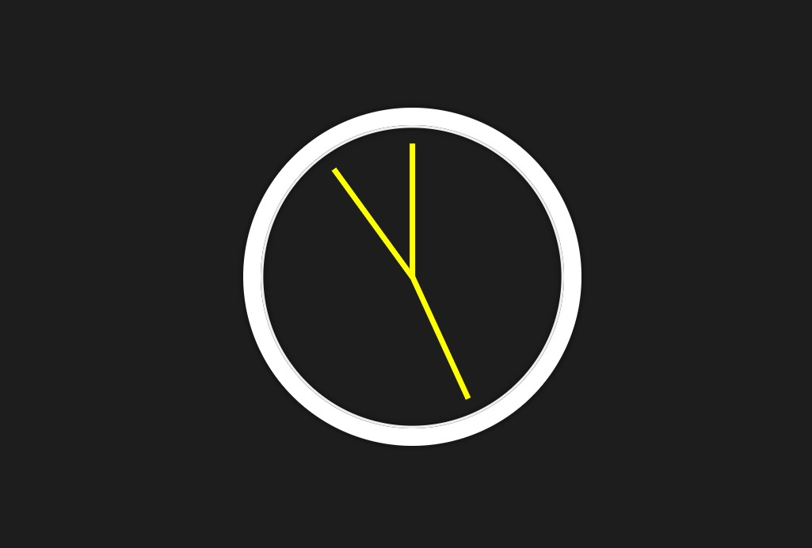

# Relógio Digital em JavaScript

[Clock](https://wesleybanagouro.github.io/Clock/)

Este projeto cria um relógio digital simples que exibe a hora atual.

## Tecnologias utilizadas

* HTML
* CSS
* JavaScript

## Contato

Para entrar em contato com o autor, envie um email para [wesley.banagouro@outlook.com]

## Captura de tela

## Ideia

Este projeto faz parte do curso #Javascript30, desenvolvido pelo WesBos.

[#Javascript30](https://javascript30.com/)

 
